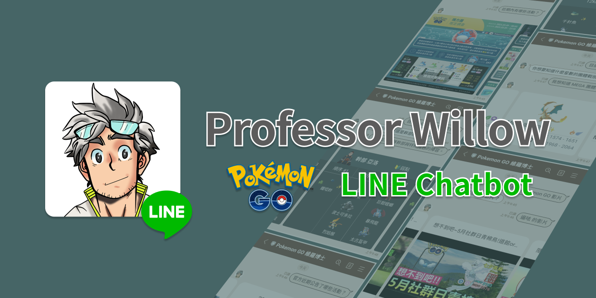
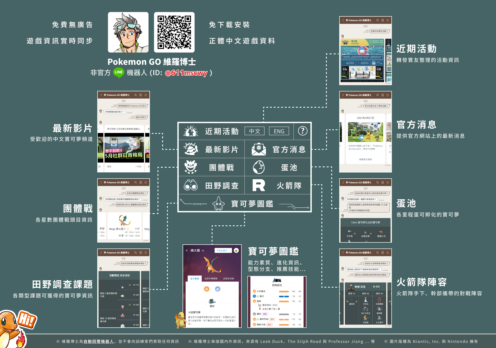

    

    小火龍 <code>#004</code>

    天生喜歡熱熱的東西。 據說當牠被雨淋濕的時候，尾巴的末端會冒出煙來。

---

## 冒險的起點

筆者是一名熱衷 Pokemon GO 的寶可夢訓練家，上班認真寫扣、下班努力抓寶。雖日復一日卻天天保有新鮮感，期待著每天的到來。

遊戲開發公司 **Niantic** 為了保留玩家對於遊玩、探索過程的新鮮感，在遊戲內的快訊經常無法得知活動的全貌。而現時活動的時效性，恐導致玩家無法有效地進行攻略而留下了遺憾。因此促進了各國熱心玩家整理的情報，當中可能是情報網站、文字訊息、圖文資訊或影片導覽 ... 等。

遊戲情報的資訊取得管道相當多元，來自於 *Twitter*、*YouTube*、*Facebook*、*巴哈姆特討論區* 與 *LINE 社群* 等各式各樣的平台。但在這幾年的遊戲過程中，筆者感受到最大的痛點就是「常態性複數活動併行，且各自的起訖時間不同」，時常會突然找不到某個曾看過的活動情報。

基於上述理由，萌生了此專案的開發念頭，希冀能夠將多方情報管道彙整為一，提供一個「不敢說是最全面，但絕對是最方便」的遊戲情報提供管道。

 

## Pokemon GO 維羅博士

LINE 聊天機器人「Pokemon GO 維羅博士」自 2021 年 2 月上線。筆者抱著能夠獲得百名訓練家的共鳴就心滿意足，萬萬沒想到上線第一個月內達到 4,000 名好友，至今已逾萬名好友加入。過程中收到許許多多來自各方訓練家的建議與反饋，目前仍在持續更新及優化當中。

「Pokemon GO 維羅博士」收集國內外熱心玩家所彙整的情報，透過 web crawler 與社群平台 APIs 取得原始資料並將其結構化儲存，再利用 LINE ChatBot 將這些即時資訊提供給每位訓練家。

> 筆者認為工程師的核心價值就是「懶」，而上述提及的爬蟲除非來源資料結構改版，基本上是全自動化的即時更新。

    <i>目前聊天機器人有提供的功能一覽</i>

 

## 內容大綱

1. **EP01: 冒險啟程！前往博士研究所** 
    > 以 Figma 進行專案項目的原型設計 (prototype)
2. **EP02: 首次對戰！遭遇捕蟲少年**
    > 以 NodeJS + TypeScript 開發網路爬蟲 (web crawler) 收集網路資料
3. **EP03: 驚心動魄！大牙狸的逆襲**
    > 以 golang 進行 LINE ChatBot 開發
4. **EP04: 一球超人！收集寶可夢圖鑑**
    > 以 React + TypeScript 進行 LINE LIFF 的網頁開發

 

---

### 圖片來源

1. 小火龍 ─ 
2. 
