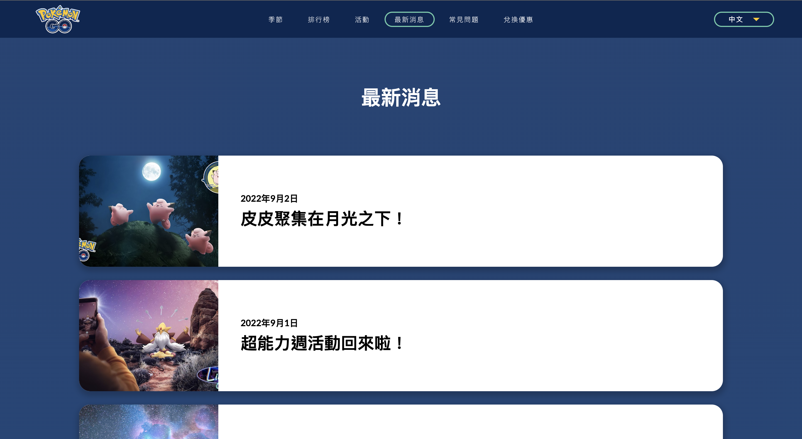
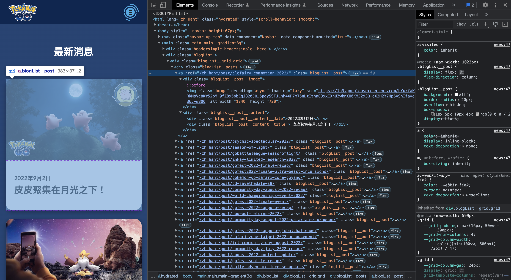
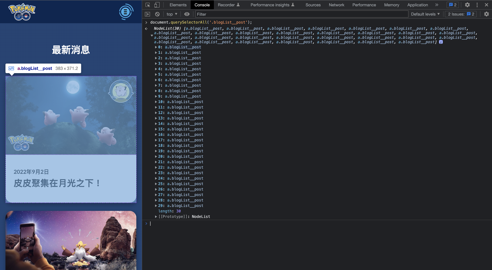
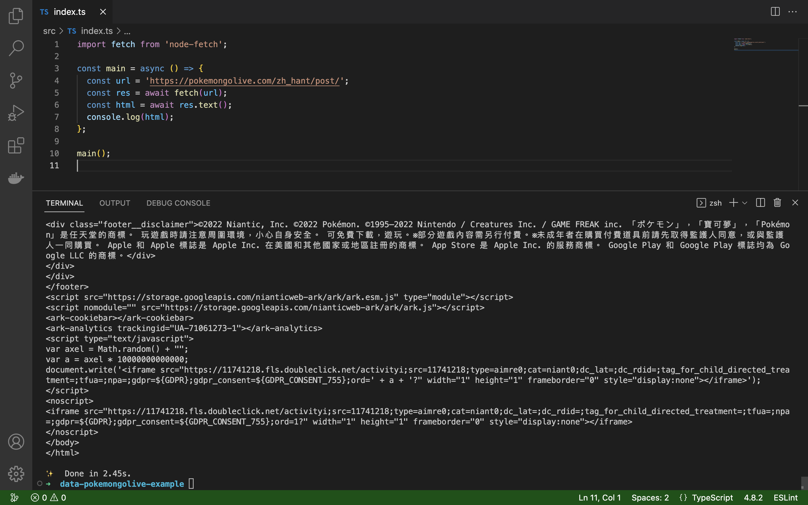

# Day 06: 爬蟲設計入門班 ①: Pokemon GO 官方網站

<p align="center">
    
</p>

<p align="center">
    電電蟲 <code>#595</code>
</p>

<p align="center">
    會附在寶可夢的身上吸收靜電。<br>自身並沒有製造電的能力。
</p>

---

## 一、Pokemon GO 官方網站

首次的爬蟲入門，我們選擇一個容易上手的案例。試著從 Pokemon GO 的官方網站最新消息爬取資料，並將其結構化儲存。
* https://pokemongolive.com/zh_hant/news



在最新消息列表中，我們要從各消息卡片中取得以下資訊：
* 日期
* 標題
* 縮圖網址
* 消息連結

### 收斂至最小的處理單位

於 Google Chrome 對畫面右鍵 > **Inspect** 開啟 devtool 後，可以試著展開 **Elements** 分頁中的 DOM (Document Object Model) ，以找到畫面中的第一則消息卡片。



在畫面中可以看到 `<a>` 節點的單位正好是完整的一張消息卡片，同時可以觀察到每一張卡片都會帶有 `blogList__post` 的 class name。

接著進入 **Console** 分頁，嘗試輸入以下 script 來驗證我們的 selector 能否找到所有的消息卡片：

```js
// '.' 代表的以 class name 進行查詢，即查詢 class name 為 'blogList__post' 的所有節點。
document.querySelectorAll('.blogList__post');
```



執行完畢後，能夠成功查詢到畫面上的 30 筆消息卡片的節點。

## 二、撰寫爬蟲

回到我們的 Node.js 專案，接著撰寫一個簡易的爬蟲程式。

### 取得 HTML

首先在 terminal 輸入以下指令安裝對應的 packages。

```bash
yarn add node-fetch
yarn add -D @types/node-fetch
```

接下來編輯 `src/index.ts`，透過 `node-fetch` 對該頁面發送請求，並輸出出來。

```ts
import fetch from 'node-fetch';

const main = async () => {
  const url = 'https://pokemongolive.com/zh_hant/post/';
  const res = await fetch(url);
  const html = await res.text();

  console.log(html);
};

main();
```

透過 `yarn start` 或 `ts-node src/index.ts` 執行。



### 取得所有消息

在 terminal 輸入以下指令安裝 `node-html-parser` packages，接著透過 `node-html-parser` 套件來對下載的 HTML 進行 DOM 的解析。

```bash
yarn add node-html-parser
```

>  是不是少了誰？ 
>
> ---
>
> 眼尖的話可能會發現，在 `node-fetch` 時會需要額外安裝一個 `@types/node-fetch` package，但 `node-html-parser` 卻不用。
>
> 這是因為不同的 npm package 可能使用 JavaScript 或 TypeScript 來開發，倘若 TS 專案引用了 JS package 將會引發錯誤。
>
> 而 [DefinitelyTyped](https://github.com/DefinitelyTyped/DefinitelyTyped) 將社群中較熱門的 JS package 們編寫了對應的 declaration files，好讓 TS 專案順利使用 JS 函式庫的同時，也同事享受 TS 帶來的優勢。

在前一章中，我們觀察到能夠使用 class name `blogList__post` 查詢到每一則卡片節點：

```ts
import fetch from 'node-fetch';
import { parse } from 'node-html-parser';

const main = async () => {
  const url = 'https://pokemongolive.com/zh_hant/post/';
  const res = await fetch(url);
  const html = await res.text();

  // 解析 HTML
  const root = parse(html);
  // 查詢 class name 為 'blogList__post' 的所有節點
  const postItems = root.querySelectorAll('.blogList__post') || [];

  // 還沒有結束哦！
};

main();
```

### 將消息資料結構化

承接上一小節的進度，我們將會遍歷 `postItems`，將每一張卡片的內資訊萃取出來。

根據第一章欲取得的四項資訊，可以設計出以下 `Post` interface：

```ts
interface Post {
  // 標題
  title: string;
  // 消息連結
  link: string;
  // 日期
  date: string;
  // 縮圖網址
  coverImageUrl: string;
}
```

在每一層的 `postItem` 中，能夠再次透過 `querySelector` 取得更深層的節點，於是可以撰寫以下程式取得全部的 `posts`：

```ts
const posts: Post[] = postItems.map((postItem) => ({
  title: postItem.querySelector('.blogList__post__content__title').rawText.trim(),
  link: urlJoin(url, postItem.getAttribute('href')!),
  date: postItem.querySelector('.blogList__post__content__date').rawText,
  coverImageUrl: postItem.querySelector('.image').getAttribute('src')!,
}));
```

#### 取得節點內的純文字

```ts
{
  title: postItem.querySelector('.blogList__post__content__title').rawText.trim(),
  // 其他屬性
}
```

#### 取得節點內特定屬性的數值

```ts
{
  coverImageUrl: postItem.querySelector('.image').getAttribute('src')!,
  // 其他屬性
}
```

>  行末出現了一個 `!` 符號，它的用途是？ 
>
> ---
>
> `getAttribute()` 除了回傳型別 `string` 之外，還有 `undefined` 的可能性，即為 union type 的 `string | undefined`。
>
> 而驚嘆號 (non-null assertion) 的用意，將會告知 TS 這項變數不會是 `null` 或 `undefined`。
>
> 註：由於這樣的寫法僅能在編譯階段示警，若在 runtime 過程 TS 是無從干涉的，建議避免使用在重要專案當中。

### 最終輸出結果

執行後，得到的 `posts` 結果如下：

```json
[
  {
    "title": "皮皮聚集在月光之下！",
    "link": "https://pokemongolive.com/zh_hant/post/zh_hant/post/clefairy-commotion-2022/",
    "date": "2022年9月2日",
    "coverImageUrl": "https://lh3.googleusercontent.com/LYukfaKRkMsVe8Wr52bM_9fZ8x5pbEgJ820JOW18WtQo5pdy5STJLhh4XP7m75nDtItnnC3xxIXnUZwknXH0KMJ2x3Q-eX3H2Y7Hp6yShIfa=e365-w800"
  },
  {
    "title": "超能力週活動回來啦！",
    "link": "https://pokemongolive.com/zh_hant/post/zh_hant/post/psychic-spectacular-2022/",
    "date": "2022年9月1日",
    "coverImageUrl": "https://lh3.googleusercontent.com/iM8xB6EJpfSLMBnZuDUqoajQfXBGKePqBhym1TQnJDR_w_Tw2k-64DQ6jgRmncki5e-Mk1cKg87GLhTJ6ho3sfV66LHsYS5E85S9JqJXGKf-=e365-w800"
  },
  // ...
]
```

## 三、範例原始碼

```ts
import fetch from 'node-fetch';
import urlJoin from 'url-join';
import { parse } from 'node-html-parser';

interface Post {
  // 標題
  title: string;
  // 消息連結
  link: string;
  // 日期
  date: string;
  // 縮圖網址
  coverImageUrl: string;
}

const main = async () => {
  const url = 'https://pokemongolive.com/zh_hant/post/';
  const res = await fetch(url);
  const html = await res.text();

  const root = parse(html);
  const postItems = root.querySelectorAll('.blogList__post') || [];

  const posts: Post[] = postItems.map((postItem) => ({
    title: postItem.querySelector('.blogList__post__content__title').rawText.trim(),
    link: urlJoin(url, postItem.getAttribute('href')!),
    date: postItem.querySelector('.blogList__post__content__date').rawText,
    coverImageUrl: postItem.querySelector('.image').getAttribute('src')!,
  }));

  console.log(posts);
};

main();
```

更完整的範例原始碼紀錄於：https://github.com/pmgo-professor-willow/data-pokemongolive
