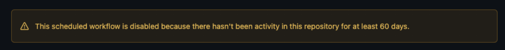

# Day 09: GitHub Actions 部署 GitHub Pages

<p align="center">
    
</p>

<p align="center">
    鋁鋼龍 <code>#884</code>
</p>

<p align="center">
    身體猶如打磨過的金屬，<br>雖然輕而堅硬，卻有著容易生鏽的弱點。
</p>

---

## 快速導覽

經過前面幾天的爬蟲練習後，接著可以嘗試將爬蟲爬下的資料，放到 GitHub Pages 以靜態檔案的方式做存放，再搭配 GitHub Actions 設定排程定時進行重新爬取與更新。

## 一、GitHub Pages

在 GitHub 上提供了一個免費網頁代管服務 GitHub Pages，若分支名稱為 `gh-pages` 能夠將該分支的內容作為靜態檔案的伺服器。

> TBD

## 二、GitHub Actions

在過去 GitHub 專案若要串接 CI/CD 的功能，必須導入如 *CircleCI*、*Travis CI* 等持續整合服務。2019 年 GitHub 發佈了 *GitHub Actions*，整體使用起來與 GitLab 自家發展的一條龍生態系 *GitLab CI/CD* 相當類似。不過當中令人最為之一亮的特色，開發者間能夠過 Marketplace 將 Actions 流通分享。

### 1. Marketplace

如先前我們使用的 npm packages 雷同，在 GitHub Marketplace 上有其他開發者分享的 Actions。
* GitHub Marketplace: https://github.com/marketplace?type=actions

### 2. 自動更新 GitHub Pages

> TBD

### 3. 讓 workflow 永續運行

當項目內沒有提交行為長達 60 天時，為了避免不活躍的專案項目的自動排程不斷運行，GitHub 偵測使用 cron 觸發的 workflow 便會自動停擺，使用者必須主動開啟延長運行的請求。

> 
> *在不知情限制的狀況下，例行的排程默默地暫停*

此時，需要新增檔案 `.github/workflows/keep-workflow-alive.yml`，並加入 `gautamkrishnar/keepalive-workflow@master` 這項社群 action 來規避限制。
* gautamkrishnar/keepalive-workflow: https://github.com/gautamkrishnar/keepalive-workflow

```yml
name: keep workflow alive
on:
  schedule:
    - cron: '0 0 * * *'

jobs:
  keepalive-workflow:
    name: Keep workflow alive
    runs-on: ubuntu-latest
    steps:
      - uses: actions/checkout@v2
      - uses: gautamkrishnar/keepalive-workflow@master
```

根據 **keepalive-workflow** 的社群提到，當 repo 內的最後一次 commit 時間已逾 50 天以上，此 action 將會創建一個 empty commit 保持專案的活躍狀態，以達到無限期的 workflow 運行。
